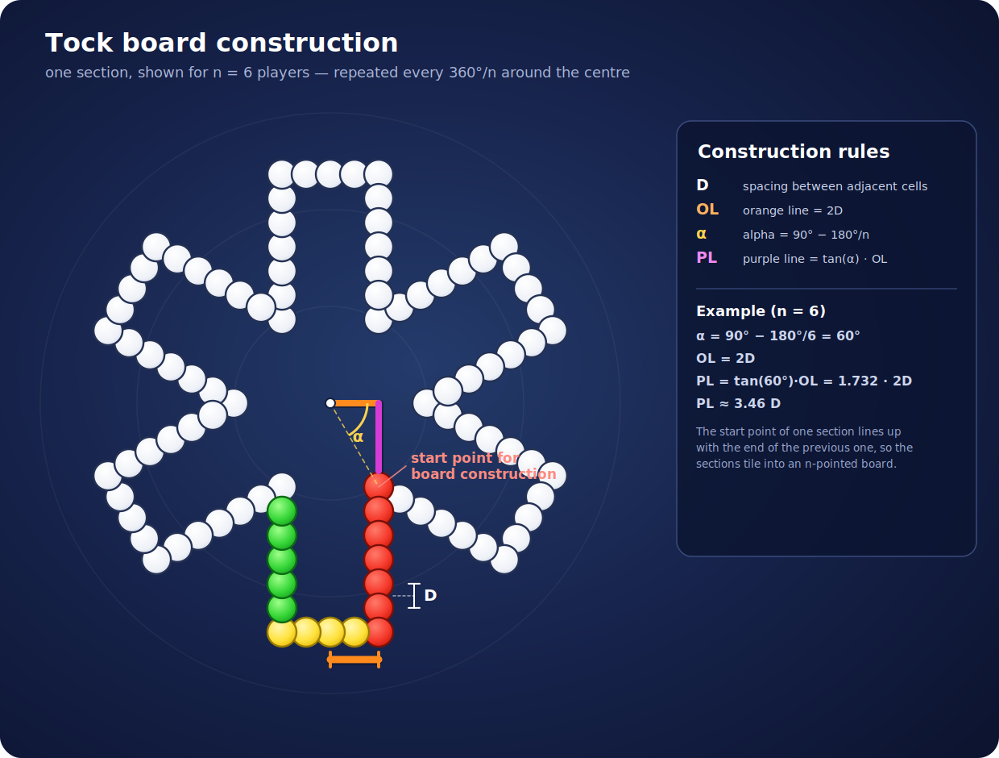

# Tock



A digital version of the Tock (Keezen) board game: an Angular frontend served by a Spring Boot backend.

## Running the app
The Spring backend serves the built Angular app (this is what `./deploy.sh` ships):

```
cd frontend && npm run build
mvn spring-boot:run -pl backend -am -Penv-angular   # Angular served at http://localhost:4200/
```

For frontend hot-reload dev, `cd frontend && npm start` runs ng serve on 4201 and proxies the
API to the backend on 4200.

## Deploying to Raspberry Pi

Run `./deploy.sh` to build the Angular app, package it into the server jar (`env-angular`),
upload, and restart the service.

**The app is reached at `/keezen`, but nginx strips that prefix before the backend.** The
Angular build sets `base-href=/keezen/`, and the app derives the prefix from `<base href>` at
runtime (`basePath()` in `src/app/base-path.ts`) so the browser requests `/keezen/games`,
`/keezen/gamestates/…/stream`, `/keezen/study-icon.svg`, etc. The nginx `location /keezen/`
block **strips** `/keezen/` (trailing slash on `proxy_pass`) and forwards `/games`, `/main-*.js`,
… to the backend:

```nginx
location /keezen/ {
  proxy_pass http://127.0.0.1:4200/;   # trailing slash → strips /keezen/
  proxy_set_header Host $host;
  # For the SSE streams (/gamestates, /chat) add if updates don't flow:
  # proxy_http_version 1.1; proxy_buffering off; proxy_read_timeout 3600s;
}
```

So the backend must serve at the **root — no context-path** (`deploy.sh` writes an empty
override). A context-path of `/keezen` here would double the prefix and 404 every request.
Local dev/tests run at the root too (default base-href `/` → `basePath()` returns `''`).

## Built with
- Angular (TypeScript) — the frontend UI
- Spring Boot — the backend and game engine
- OpenAPI — the API contract and generated TypeScript client
- Testing — JUnit + Vitest unit tests, Playwright end-to-end browser tests, Mockito
- Continuous Integration

_This started as a GWT project (Java compiled to JavaScript) and was migrated to Angular._
